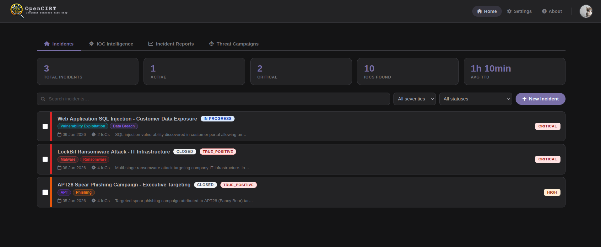

# OpenCIRT — Incident Response Platform

OpenCIRT is an open-source platform for cybersecurity teams to manage the full incident response lifecycle.

---



---

## Features

- **Incident management** — track incidents with severity, status, TLP classification, and timelines
- **Evidence collection** — log actions, attach files, and capture IOCs
- **Collaborative investigation** — role-based access per incident (Lead, Analyst, Reader)
- **IOC enrichment** — VirusTotal, AbuseIPDB, MISP integration
- **Report export** — PDF / DOCX with configurable sections
- **AI assistance** — optional Anthropic / OpenAI integration

## Quick start (Docker)

```bash
git clone https://github.com/nicoloo/OpenCIRT.git
cd OpenCIRT
cp .env.example .env
# Edit .env: set SECRET_KEY and POSTGRES_PASSWORD
docker compose up --build
```

Open [http://localhost](http://localhost) — username `admin`, password printed in the container logs on first start.

> **Demo data:** set `LOAD_DEMO_DATA=true` in `.env` before the first `docker compose up` to load sample incidents automatically.

## Environment variables

| Variable | Required | Description |
|---|---|---|
| `SECRET_KEY` | Yes | Django secret key |
| `POSTGRES_PASSWORD` | Yes | Database password |
| `ALLOWED_HOSTS` | No | Comma-separated allowed hosts (default: `localhost,127.0.0.1`) |
| `LOAD_DEMO_DATA` | No | Set to `true` to seed sample incidents on first migrate |
| `ANTHROPIC_API_KEY` | No | AI rephrasing features |
| `OPENAI_API_KEY` | No | Alternative AI provider |
| `VIRUSTOTAL_API_KEY` | No | IOC enrichment |
| `ABUSEIPDB_API_KEY` | No | IP reputation lookups |

## Contributing

Contributions, integrations, and feedback are welcome. See [SECURITY.md](SECURITY.md) for reporting vulnerabilities.

---

Made by [@nicoloo](https://github.com/nicoloo)
